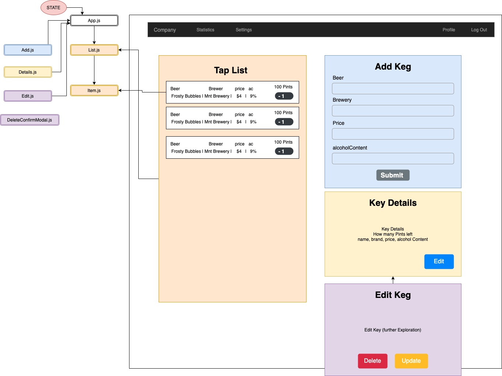

# McCord's Tap Room
### A simple tap room menu app made with React. 
### _By Dusty McCord. Last updated April 24, 2020_

## Description
This app will show all the kegs available in a tap room and allow a user to up update the points sold and add new kegs. 

### [Link to working demo](https://gallant-dijkstra-379443.netlify.app/)

## Specs

* As a user, I want to see a list/menu of all available kegs. For each keg, I want to see its name, brand, price and alcoholContent (or perhaps something like flavor for a kombucha store).
* As a user, I want to submit a form to add a new keg to a list.
* As a user, I want to be able to click on a keg to see its detail page.
* As a user, I want to see how many pints are left in a keg. Hint: A full keg has roughly 124 pints.
* As a user, I want to be able to click a button next to a keg whenever I sell a pint of it. This should decrease the number of pints left by 1. Pints should not be able to go below 0.

  
## Component diagram / Wireframe




## Installation instructions

Clone the project by typing this command into your terminal.
```sh
git clone https://github.com/dustatron/tap-room-react
```

In the project directory, you can run: 

 ```sh
 npm start
```
Runs the app in the development mode.<br />
Open [http://localhost:3000](http://localhost:3000) to view it in the browser.

The page will reload if you make edits.<br />
You will also see any lint errors in the console.

 ```sh
 npm test
```
Launches the test runner in the interactive watch mode.<br />
See the section about [running tests](https://facebook.github.io/create-react-app/docs/running-tests) for more information.

 ```sh
  npm build
 ```

Builds the app for production to the `build` folder.<br />
It correctly bundles React in production mode and optimizes the build for the best performance.

The build is minified and the filenames include the hashes.<br />
Your app is ready to be deployed!

See the section about [deployment](https://facebook.github.io/create-react-app/docs/deployment) for more information.

 ```sh
  npm eject
 ```
**Note: this is a one-way operation. Once you `eject`, you can’t go back!**

If you aren’t satisfied with the build tool and configuration choices, you can `eject` at any time. This command will remove the single build dependency from your project.

Instead, it will copy all the configuration files and the transitive dependencies (webpack, Babel, ESLint, etc) right into your project so you have full control over them. All of the commands except `eject` will still work, but they will point to the copied scripts so you can tweak them. At this point you’re on your own.

You don’t have to ever use `eject`. The curated feature set is suitable for small and middle deployments, and you shouldn’t feel obligated to use this feature. However we understand that this tool wouldn’t be useful if you couldn’t customize it when you are ready for it.

## Support 

_The software is provided as is. It might work as expected - or not. Use at your own risk._


## Built With

* [HTML](https://developer.mozilla.org/en-US/docs/Web/HTML) - Simple Scaffolding
* [JavaScript](https://developer.mozilla.org/en-US/docs/Web/JavaScript) - Used for interactivity in the page
* [jQuery](https://jquery.com/) - Used to interact with the DOM
* [Bootstrap 4.4](https://getbootstrap.com/) - Used for styling
* [webpack](https://webpack.js.org/)
* [Sass](https://sass-lang.com/)
* [ESLint](https://eslint.org/)
* [Node.js](https://nodejs.org/en/)
* [Uglifyjs](https://www.uglifyjs.net/)


### License

This project is licensed under the MIT License - see the [LICENSE.md](LICENSE.md) file for details

Copyright (c) 2020 **_Dusty McCord_**

